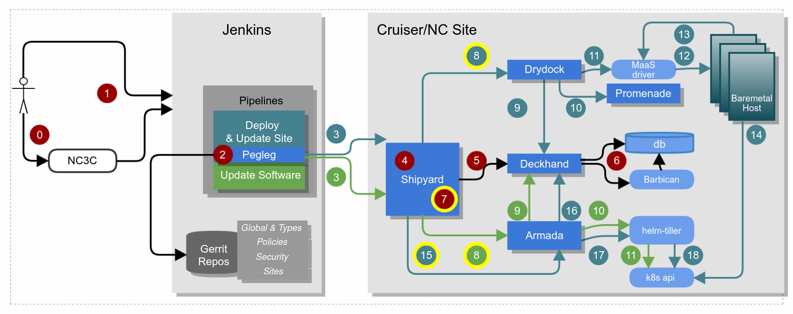

****************************
Airship 1.0 Deployment Flows
****************************

.. |vspace| raw:: latex

   \vspace{5mm}

Airship 1.0 Deploy and Update Site Flow
#######################################

1. Pegleg facilitates cloning the repositories necessary to interact with
   a site.  Each site has a single site-definition.yaml which contains
   the repositories that “compose” that site.  These may be global
   repositories, type level repositories (e.g. cruisers or cloud harbor),
   and finally site-level repositories.  These may be entirely different
   repositories with different permissions.  Pegleg facilitates cloning
   all of these at the correct revisions according to the definition for
   that site. Pegleg can be driven via a Jenkins pipeline, which can be
   further abstracted in something like an NC3C dashboard, or it can be
   driven on the command line directly by imitating the behavior in the
   pipeline.

|vspace|

2. Pegleg wears several different hats.  The CI/CD workflows leverage
   different pipelines in order to call upon these hats but under the
   hood, it’s really just different command line flags on the pegleg CLI
   command depending on what type of action is occurring.  Pegleg can:

   a. Generate (and re-generate/rotate) new secure secrets for a site
      according to each secret’s  requirement (e.g. length, type, and so
      on). For instance: UUIDs, passwords, keys, and so on.

      |vspace|

   b. Encrypt secrets, and Decrypt secrets.  When secrets are encrypted,
      they are wrapped in a YAML envelope containing metadata for each
      secret.  This allows for understanding when secrets are going to
      expire, when they were last rotated, and so on.  All deployment and
      update pipelines for instance would leverage the decrypt functionality
      in order to render the documents successfully.

      |vspace|

   c. Lint the YAML to ensure it is valid and meets certain basic syntax
      criteria and deckhand does not have an issue processing rules
      encountered.  For instance, development gating pipelines that validate
      changes to YAML would invoke pegleg in this way.

      |vspace|

   d. Render will actually process the documents through the deckhand
      library, which will perform substitutions, pull in the secrets that
      are referenced from the configuration YAML so you can see the target
      document locally.  This is effectively a very in-depth linting process
      and again would be used in development gates and potentially to
      fast-fail in deployment and update pipelines if there was an issue.

      |vspace|

   e. Collect will bundle up all the documents but not actually render them
      which is appropriate for deployment and update pipelines as it sends
      the documents through raw (but presumably with decrypted secrets)
      because each cloud site has its own deckhand instance running
      maintaining its own revision history capable of rendering the
      documents in-site.  It is used in every deployment and update pipeline
      as the results of collect are what is sent to shipyard.

|vspace|

3. Once pegleg has decrypted the secrets in the document set within an
   ephemeral Jenkins pipeline, pegleg collect is called to assemble them
   all, and finally that is piped to the shipyard client which will
   publish them via REST API to a Shipyard API service running within the
   site. There are two scenarios under which Shipyard may be running in
   the site.

   a. On the genesis host, which is a single node running Kubernetes in a
      green-field site that will be expanded to a full cluster once more
      nodes are provisioned.

      |vspace|

   b. On the control plane of a greenfield site, receiving a site-update
      or expansion.

   Simply put, the entire Shipyard workflow can be summarized as follows:

   * Initial region/site data will be passed to Shipyard from either a
     human operator or Jenkins
   * The data (in YAML format) will be sent to Deckhand for validation and storage
   * Shipyard will make use of the post-processed data from DeckHand to
     interact with Drydock.
   * Drydock will interact with Promenade to provision and deploy bare metal
     nodes using Ubuntu MAAS and a resilient Kubernetes cluster will be created
     at the end of the process
   * Once the Kubernetes clusters are up and validated to be working properly,
     Shipyard will interact with Armada to deploy OpenStack using OpenStack Helm
   * Once the OpenStack cluster is deployed, Shipyard will trigger a workflow to
     perform basic sanity health checks on the cluster

|vspace|

4. Shipyard will do a number of pre-validations before delivering the
   document set to deckhand.  Things such as a concurrency check, to
   ensure we don’t try to run updates in parallel unaware of each other.
   It will also run a number of fail-fast validation checks.

|vspace|

5. Shipyard will leverage the deckhand client library to deliver the
   documents to deckhand over its REST API, which will again validate
   them and render them (which again involves performing all layering,
   substitution, secret interpolation, and so on) and publishes a
   document revision, so that there is an on-site record of every change
   that has ever been requested.  This document revision that is fully
   rendered will be available at a deckhand REST API URL that can be
   retrieved by various Airship sub-components.

|vspace|

6. Deckhand will store secrets within Barbican so that they are not
   stored in clear text within a database, and the rendered document set
   revision itself is stored directly in a database.  Deckhand will
   change every secret to a Barbican reference which will be rendered
   on-demand by Deckhand whenever someone asks for that document revision
   through the API.

|vspace|

7. At this point, with the documents stored in Deckhand, Shipyard will
   perform another fail-fast step and ask each of the components
   highlighted in yellow to perform a dry-run no-op validation of the
   entire document set from their perspective.  This means that Drydock
   for instance, would be validating and acknowledging it would not have
   any issue processing the document set it sees in Deckhand.  This
   helps ensure we do not encounter updates that fail in the middle
   of the process.  If a component is unhappy with the document set
   we want to know early and fail before making any changes.

|vspace|

8. Shipyard will now invoke Drydock to provision baremetal hosts that
   have not already been provisioned and continue to call back or poll
   for when Drydock has completed this process.  Airship has a concept
   called deployment strategies because the hardware aspect of
   deployment is not guaranteed or reliable, and we don’t always want
   failures here to block every other process in the stack.  In other
   words, our deployment strategies require that 100% of nodes marked
   as control plane nodes must be provisioned successfully to
   continue, but that a certain percentage of each rack of workers
   could fail and we can still continue past the hardware
   provisioning steps successfully.  In other words, this is where we
   introduce a threshold of failure.

|vspace|

9. Shipyard will send Drydock the Deckhand URL to obtain the document set
   for itself for this update.  Drydock will retrieve the entire document
   set from Deckhand but it will only process documents it cares
   about.

|vspace|

10. Drydock will process any Drydock/BootAction documents that have
    external references in them to render those upfront before writing an
    operating system to the physical host.  Most importantly, this allows
    Promenade to construct a host-specific join script.   In other words,
    Drydock calls out to the Promenade REST API to construct a join shell
    script for each host and this is driven by Drydock/Bootaction
    documents.

|vspace|

11. Drydock will orchestrate MaaS based on the document set.  It does this
    through several internal tasks, prepare_site, prepare_nodes, and
    deploy_site.  Within prepare_site, upfront orchestration of MaaS
    occurs setting non-host specific settings via the MaaS API, such as
    CIDRs, and VLANs.  Within prepare_nodes, we identify hosts that
    haven’t already been provisioned and then power cycle hosts, wait for
    them to be discovered by MaaS, and then aligning and renaming them to
    hosts in our static inventory. Then the host configuration is
    orchestrated in MaaS so they have the proper networking and storage
    configuration as well as receive the correct static overlays, like
    Kubernetes join scripts, the correct Drivers, and so on, on
    first-boot.  Finally within Drydock’s deploy_nodes task we orchestrate
    several MaaS flows to actually provision the nodes with an operating
    system where they execute any additional static scripts delivered on
    first-boot.

|vspace|

12. During the deploy_nodes phase of Drydock, MaaS is effectively writing
    an operating system to the baremetal nodes.

|vspace|

13. Driven by cloud-init on first boot post provision, the nodes will
    actually make a rest call back to the MaaS API to inform it that
    provisioning has completed and they have successfully booted up into
    functional networking and have booted up successfully.  Drydock can
    use this status within MaaS to understand the nodes were provisioned
    successfully.

|vspace|

14. The nodes run the Promenade generated shell script to join them to
    Kubernetes. This host-specific script installs the appropriate
    dependencies and joins the node as a Kubernetes node, either as a
    worker, or as a control plane host depending on the hosts profile in
    the YAML inventory.

|vspace|

15. Shipyard has been polling Drydock for completion of processing the
    site update. Once the polling for Drydock provisioning completes,
    Shipyard will move on to performing a similar request to Armada.
    Armada is asked to update the site and given a Deckhand URL and
    revision to pull from.

|vspace|

16. Armada pulls the rendered document set from Deckhand.

|vspace|

17. Armada then proceeds to help orchestrate any helm installs or upgrades
    necessary in the site, and helps do this across a vast number of
    charts, their ordering, and dependencies. Armada also supports
    fetching Helm chart source and then building charts from source from
    various local and remote locations, such as Git endpoints, tarballs or
    local directories.  It will also give the operator some indication of
    what is about to change by assisting with diffs for both values,
    values overrides, and actual template changes. Its functionality
    extends beyond Helm, assisting in interacting with Kubernetes directly
    to perform basic pre- and post-steps, such as removing completed or
    failed jobs, running backup jobs, blocking on chart readiness, or
    deleting resources that do not support upgrades. However, primarily,
    it is an interface to support orchestrating Helm.

|vspace|

18. Armada effectively interacts with Tiller for installation (although it
    may interact with k8s directly to poll, wait, remove jobs, and
    otherwise help protect helm from failures).  Tiller will then interact
    with k8s to perform helm chart installations or upgrades.

Airship 1.0 Update Software Flow
################################

The Update Software flow (or “action” in Shipyard -- depicted with
green numbers in the image) is effectively a subset of the above flow.
It is used primarily to speed the process up by bypassing the Drydock
flow entirely. The reason for this is both speed as interacting with
MaaS is slow, as well as times where you want to avoid trying to
process hardware requests (e.g. waiting for Drydock to try and
provision a piece of failed hardware only to ultimately timeout some
time later before moving on to the next step because the deployment
strategy allows it).

Further Documentation
#####################

* https://airshipit.readthedocs.io/projects/shipyard/en/latest/
* https://airshipit.readthedocs.io/projects/pegleg/en/latest/
* https://airshipit.readthedocs.io/projects/armada/en/latest/
* https://airshipit.readthedocs.io/projects/promenade/en/latest/
* https://airshipit.readthedocs.io/projects/drydock/en/latest/
* https://airshipit.readthedocs.io/projects/deckhand/en/latest/
* https://airshipit.readthedocs.io/en/latest/

