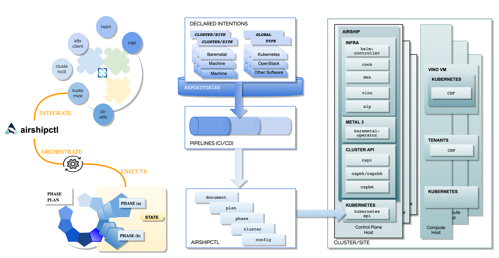

.. _site_setup_guide:

System Requirement and Setup
============================

Component Overview
------------------

Airship uses a command line utility airshipctl that drives the deployment and
life cycling management of Kubernetes clouds and software stacks.

This utility articulates lifecycle management as a list of phases, or as a
plan of phases or plan. For each of these phases, a YAML document set is
rendered and Airshipctl transparently utilizes the appropriate set of CNCF
projects to deliver that particular phase.

Node Overview
-------------

This document refers to several types of nodes, which vary in their
purpose, and to some degree in their orchestration / setup:

-  **Build node**: This refers to the environment where configuration
   documents are built for your environment (e.g., your laptop).
-  **Ephemeral node**: The "ephemeral" or "seed node" refers to a node used
   to get a new deployment off the ground, and is the first node built
   in a new deployment environment.
-  **Controller nodes**: The nodes that make up the control plane. (Note that
   the ephemeral node will be converted to one of the controller nodes).
-  **Worker nodes**: The nodes that make up the data plane.

Hardware Preparation
--------------------

The Treasuremap `reference-airship-core`_ site shows a production-worthy
bare metal deployment that includes multiple disks and redundant/bonded
network configuration.

.. Note::
  Airship hardware requirements are flexible, and the system can be
  deployed with very minimal requirements if needed (e.g., single disk, single
  network).

  For simplified non-bonded, and single disk examples, see Airshipctl
  `test-site`_.

.. _reference-airship-core: https://github.com/airshipit/treasuremap/tree/master/manifests/site/reference-airship-core

.. _test-site: https://github.com/airshipit/airshipctl/tree/master/manifests/site/test-site

BIOS, Redfish and PXE
~~~~~~~~~~~~~~~~~~~~~

1. Ensure that virtualization is enabled in BIOS.
2. Ensure that Redfish IPs assigned, and routed to the environment you will
   deploy into. Firmware bugs related to Redfish are common. Ensure you are
   running the latest firmware version for your hardware.
3. Set PXE as first boot device and ensure the correct NIC is selected for PXE.

.. note::
   * Airship can remotely bootstrap the nodes using Redfish. If Redfish is not
     available, you can mount the ephemeral ISO image via an alternate
     mechanism such as USB thumb drive.
   * Airship 2 has been verified on Dell PowerEdge R740xd servers with iDRAC 9,
     BIOS Version 2.8.2, iDRAC Firmware Version 4.22.00.53 and Redfish API
     version 1.

.. _Disk:

Disk
~~~~

1. For controller nodes including the ephemeral node:

  - Two-disk RAID-1: Operating System

2. For worker nodes (tenant data plane):

   - Two-disk RAID-1: Operating System
   - Remaining disks: configuration per worker host profile

3. For nodes in the storage cluster:

   After the allocation of disks for the host OS and other uses, remaining
   disks can be configured as RAID-0/JBOD for Ceph. If both SSD and HDD disks
   are present, it is recommended to configure two Ceph clusters, one for each
   media technology. The number of storage disks and capacity per disk should
   be determined by the need of the workloads.

Network
~~~~~~~

1. Ensure that you have a dedicated PXE interface on untagged/native VLAN.
   1x1G interface is recommended. The PXE network must have routability to
   the internet in order to fetch the provisioning disk image; alternately,
   you may host the image locally on the PXE network itself.

2. Ensure that you have VLAN segmented networks on all nodes. 2x25G bonded
   interfaces are recommended.

The table below is an opinionated example used by Treasuremap reference site
``reference-airship-core``, but users can diverge from it as needed. For
example, in the simplest configuration, two networks can be configured: one
for PXE and one for everything else.

+---------+-------------+--------------+----------+------+----------------------------------------------+
| VLAN/   |    Name     | Routability  | Quantity | MTU  |         Description                          |
| Network |             |              |          |      |                                              |
+=========+=============+==============+==========+======+==============================================+
|   1023  |   OOB/iLO   |     WAN      | IPv4:/26 | 1500 | For HW Redfish addressing                    |
|         |             |              | IPv6:/64 |      |                                              |
+---------+-------------+--------------+----------+------+----------------------------------------------+
|   eno4  |     PXE     |   Private    | IPv4:/25 | 1500 | For bootstrap by Ironic, Metal3 or MaaS      |
|         |             |   RFC1918    | IPv6:/64 |      |                                              |
+---------+-------------+--------------+----------+------+----------------------------------------------+
|   61    |     OAM     |     WAN      | IPv4:/26 | 9100 | - Used for operational access to Hosts.      |
|         |             |              | IPv6:/64 |      | - Can reach to OOB, PXE, DNS, NTP,           |
|         |             |              |          |      |   Airship images and manifest repos          |
|         |             |              |          |      | - Hosts all host level endpoints             |
+---------+-------------+--------------+----------+------+----------------------------------------------+
|         |     OAM     |     WAN      | IPv4:/29 | 9100 | - Rack floating VIP for K8S ingress traffic  |
|         |             |              |          |      | - Configured as secondary subnet for VLAN 41 |
|         |             |              |          |      | - Hosts all service endpoints                |
+---------+-------------+--------------+----------+------+----------------------------------------------+
|   62    |   Storage   |   Private    | IPv4:/25 | 9100 | Ceph storage traffic for all hosts, pods and |
|         |             |   RFC1918    | IPv6:/64 |      | VMs                                          |
+---------+-------------+--------------+----------+------+----------------------------------------------+
|   64    |   Calico    |   Private    | IPv4:/25 | 9100 | L2 network used by Calico for BGP peering or |
|         |             |   RFC1918    | IPv6:/64 |      | or IP-in-IP mesh                             |
+---------+-------------+--------------+----------+------+----------------------------------------------+
|   82    |  Subcluster |   Private    | IPv4:/22 | 9100 | Private IP ranges to VM based subclusters    |
|         |  Net        |   RFC1918    | IPv6:/64 |      | for K8S as a service                         |
+---------+-------------+--------------+----------+------+----------------------------------------------+
| Private |  CNI Pod    | Zone Private | IPv4:/16 | N/A  | For Kubernetes Pods and objects by Calico    |
| Reserve |  Network    |              | IPv6:/64 |      |                                              |
+---------+-------------+--------------+----------+------+----------------------------------------------+
| Private |  k8S Service| Zone Private | IPv4:/16 | N/A  | For K8S service objects and intermediary     |
| Reserve |  Network    |              | IPv6:/64 |      | pods                                         |
+---------+-------------+--------------+----------+------+----------------------------------------------+

See detailed network configuration example in the Treasuremap repo
``manifests/site/reference-airship-core/target/catalogues/networking.yaml``
configuration file.

Hardware sizing and minimum requirements
----------------------------------------

+-------------------+----------+----------+----------+
|  Node             |   Disk   |  Memory  |   CPU    |
+===================+==========+==========+==========+
| Build (laptop)    |   10 GB  |   4 GB   |    1     |
+-------------------+----------+----------+----------+
| Ephemeral/Control |  500 GB  |  64 GB   |   24     |
+-------------------+----------+----------+----------+
| Worker            |   N/A*   |  N/A*    |   N/A*   |
+-------------------+----------+----------+----------+

* Workload driven (determined by host profile)

See detailed hardware configuration in the Treasuremap repo
``manifests/site/reference-airship-core/target/catalogues`` folder.

.. _establishing_build_node:

Establishing build node
-----------------------

Setting Environment Variables
~~~~~~~~~~~~~~~~~~~~~~~~~~~~~

The Airship deployment tool requires a few environment variables that the
operators need to configure on the build node. The environment variables can
be persisted by setting them in your profile, or can be set in the shell
session before you run the Airship commands and scripts.

Proxy
+++++

Access to external resources such as ``github``, ``quay.io`` and ``go`` is
required for downloading manifests, images and ``go`` packages. If you are
behind a proxy server, the following environment variables must be configured
on the build node.

 * ``USE_PROXY``: Boolean value to indicate if the proxy setting should be used
   or not.
 * ``http_proxy``: Proxy server for HTTP traffic.
 * ``https_proxy``: Proxy server for HTTPS traffic.
 * ``no_proxy``: IP addresses or domain names that shouldn’t use the proxy.

SOPS
++++

For security reasons the secrets in the Airship manifests should not be stored
in plain-text form. Airshipctl selects `Mozilla SOPS`_ to encrypt and decrypt
the manifests.

.. _Mozilla SOPS:
    https://github.com/mozilla/sops

Two environment variables are needed for the encryption and decryption:

   * ``SOPS_IMPORT_PGP``: Contains public or private key (or set of keys).
   * ``SOPS_PGP_FP``: Contains a fingerprint of the public key from the list of
     provided keys in ``SOPS_IMPORT_PGP`` that will be used for encryption.

The easiest way to generate SOPS keys is to use gpg wizard:

.. code-block:: bash

    gpg --full-generate-key

For demo purpose, you can import the pre-generated SOPs keys used by Airshipctl
gate:

.. code-block:: bash

    curl -fsSL -o /tmp/key.asc https://raw.githubusercontent.com/mozilla/sops/master/pgp/sops_functional_tests_key.asc
    export SOPS_IMPORT_PGP="$(cat /tmp/key.asc)"
    export SOPS_PGP_FP="FBC7B9E2A4F9289AC0C1D4843D16CEE4A27381B4"

Airship Installation
++++++++++++++++++++

 * ``AIRSHIP_CONFIG_MANIFEST_DIRECTORY``: File system path to the Airship
   manifest directory, which will be the home of all Airship artifacts,
   including airshipctl, treasuremap, your projects and sites. You can create
   the directory at a location of your choice.
 * ``PROJECT``: Name of the project directory to be created in the :ref:`init_site`
   section.
 * ``SITE``: Name of the site to be deployed.

Download Airship
~~~~~~~~~~~~~~~~

1. On the build node, install the Git package:

.. code-block:: bash

    sudo apt update
    sudo DEBIAN_FRONTEND=noninteractive apt -y install git

2. Create the Airship home directory and clone the ``airshipctl`` and ``treasuremap`` repository:

.. code-block:: bash

    mkdir -p $AIRSHIP_CONFIG_MANIFEST_DIRECTORY
    cd $AIRSHIP_CONFIG_MANIFEST_DIRECTORY
    git clone https://opendev.org/airship/airshipctl.git
    pushd airshipctl
    git checkout <release-tag|branch|commit-hash>
    popd
    git clone https://opendev.org/airship/treasuremap.git
    pushd treasuremap
    git checkout <release-tag|branch|commit-hash>
    popd

Install Essential Tools
~~~~~~~~~~~~~~~~~~~~~~~

1. Install the essentials tools, including kubectl, kustomize, pip, and yq.

   From the `treasuremap` directory, run:

.. code-block:: bash

    ./tools/deployment/airship-core/01_install_essentials.sh
    # Recommend to add the user to the docker group
    sudo usermod -aG docker $USER

2. Install airshipctl executable.

.. code-block:: bash

    ./tools/deployment/airship-core/21_systemwide_executable.sh

2. (Optional) Install Apache Web server.

   Airship 2 deployment requires a web server to host the generated ephemeral
   ISO image. If you don't have an existing web server, you can install an
   `Apache server`_ on the build node.

.. code-block:: bash

    sudo apt install apache2

.. note:: The Apache Web server must be accessible by the ephemeral host.

.. _Apache server:
    https://ubuntu.com/tutorials/install-and-configure-apache

After the build node is established, you are ready to start creating your site
manifests and deploying the site.
